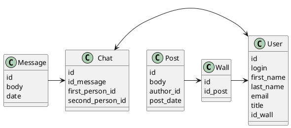

# Компонентная архитектура
<!-- Состав и взаимосвязи компонентов системы между собой и внешними системами с указанием протоколов, ключевые технологии, используемые для реализации компонентов.
Диаграмма контейнеров C4 и текстовое описание.
-->
## Компонентная диаграмма

```plantuml
@startuml
!include https://raw.githubusercontent.com/plantuml-stdlib/C4-PlantUML/master/C4_Container.puml

AddElementTag("microService", $shape=EightSidedShape(), $bgColor="CornflowerBlue", $fontColor="white", $legendText="microservice")
AddElementTag("storage", $shape=RoundedBoxShape(), $bgColor="lightSkyBlue", $fontColor="white")

Person(admin, "Администратор")
Person(moderator, "Модератор")
Person(user, "Пользователь")

System_Ext(web_site, "Клиентский веб-сайт", "HTML, CSS, JavaScript, React", "Веб-интерфейс")

System_Boundary(conference_site, "Социальная сеть") {
   'Container(web_site, "Клиентский веб-сайт", ")
   Container(client_service, "Сервис авторизации", "C++", "Сервис управления пользователями", $tags = "microService")
   Container(post_service, "Сервис записей", "C++", "Сервис управления записями", $tags = "microService")
   Container(blog_service, "Сервис сообщений", "C++", "Сервис управления сообщениями", $tags = "microService")
   ContainerDb(db, "База данных", "MySQL", "Хранение данных о записях, сообщениях и пользователях", $tags = "storage")

}

Rel(admin, web_site, "Просмотр, добавление и редактирование информации о пользователях, записях и сообщениях")
Rel(moderator, web_site, "Модерация контента и пользователей")
Rel(user, web_site, "Регистрация, просмотр информации о записях и сообщениях и получения их")

Rel(web_site, client_service, "Работа с пользователями", "localhost/person")
Rel(client_service, db, "INSERT/SELECT/UPDATE", "SQL")

Rel(web_site, post_service, "Работа с записями", "localhost/pres")
Rel(post_service, db, "INSERT/SELECT/UPDATE", "SQL")

Rel(web_site, blog_service, "Работа с сообщениями", "localhost/conf")
Rel(blog_service, db, "INSERT/SELECT/UPDATE", "SQL")

@enduml
```
## Список компонентов

### Сервис авторизации
**API**:
-	Создание нового пользователя
      - входные параметры: login, пароль, имя, фамилия, email, обращение (г-н/г-жа)
      - выходные параметры: отсутствуют
-	Поиск пользователя по логину
     - входные параметры:  login
     - выходные параметры: имя, фамилия, email, обращение (г-н/г-жа)
-	Поиск пользователя по маске имени и фамилии
     - входные параметры: маска фамилии, маска имени
     - выходные параметры: login, имя, фамилия, email, обращение (г-н/г-жа)

### Сервис стены
**API**:
- Добавление записи на стену
  - Входные параметры: идентификатор пользователя, содержание записи, автор записи, дата создания
  - Выходыне параметры: идентификатор записи
- Загрузка стены пользователя
  - Входные параметры: идентификатор пользователя
  - Выходные параметры: массив с записями, где для каждой указаны её идентификатор, содержание, автор и дата создания


### Сервис сообщений
**API**:
- Отправка сообщения пользователю
  - Входные параметры: идентификатор чата, содержание сообщения, автор сообщения, дата и время отправки
  - Выходные параметры: идентификатор сообщения
- Получение списка сообщений для пользователя
  - Входные параметры: идентификатор чата
  - Выходные параметры: массив с полученными и отправленными сообщениями (идентификатор сообщения, содержание сообщения, автор, дата и время отправки)


### Модель данных

